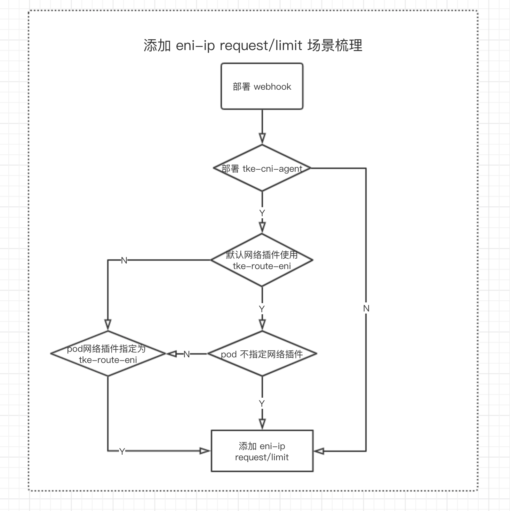

# add-pod-eni-ip-limit-webhook

## 背景
`tke-route-eni` 网络方式将 `eni-ip` 作为一种 `extend resources`，每个节点上能分配的 `eni-ip` 是不同的。为了让 pod 调度到 `eni-ip` 充足的节点上，需要显示在 `pod.spec.containers[0].resources` 中 `request` `eni-ip`。

额外添加该 `request` 比较繁琐，因此引入 [MutatingAdmissionWebhook](https://kubernetes.io/docs/reference/access-authn-authz/admission-controllers/#mutatingadmissionwebhook) 给使用 `tke-route-eni` 类型 pod 添加 `tke.cloud.tencent.com/eni-ip` request 和 limit。


## 限制
* 容器网络使用 `tke-route-eni`
* 确保 kube-apiserver 启用 `MutatingAdmissionWebhook` admission controller


## 使用
### 部署 webhook

```$xslt
kubectl create ./deploy/webhook-registration.yaml
kubectl create ./deploy/webhook-rbac.yaml
kubectl create ./deploy/webhook.yaml
```

### 创建 pod
* 执行以下命令
```$xslt
kubectl run busybox --image busybox --command -- sleep 1000000
```
* 执行以下命令，观察到 pod 添加了 `tke.cloud.tencent.com/eni-ip` request 和 limit
```$xslt
# kubectl get po | grep busybox | awk '{print $1}' | xargs -n1 kubectl describe po
Name:           busybox-5bbb5d7ff7-64d68
Namespace:      default
Node:           <none>
Labels:         pod-template-hash=5bbb5d7ff7
                run=busybox
Annotations:    <none>
Status:         Pending
IP:
Controlled By:  ReplicaSet/busybox-5bbb5d7ff7
Containers:
  busybox:
    Image:      busybox
    Command:
      sleep
      100000
    Limits:
      tke.cloud.tencent.com/eni-ip:  1
    Requests:
      tke.cloud.tencent.com/eni-ip:  1
```


### webhook 运行参数
| 参数 | 含义 | 默认 | 变更风险 | 示例 |
|:---|:---:|:----:|:-----:|:----|
|`--tls-cert-file`|服务端证书|空|***确保证书合法***|`--tls-cert-file=/webhook.local.config/certificates/tls.crt`|
|`--tls-private-key-file`|服务端私钥|空|***确保私钥合法***|`--tls-private-key-file=/webhook.local.config/certificates/tls.key`|


## 和 tke-cni-agent 搭配使用
[tke-cni-agent](https://github.com/qyzhaoxun/multus-cni) 是 `tke` 团队基于 `multus-cni` 实现的可以让 pod 自主选择网络插件的组件。

<p align="center">
   
</p>


## 开发指引
* `make` 默认执行 `make build` 会构建 Linux 平台二进制文件。
* `make docker-build` 会采用 docker 构建 Linux 平台二进制文件。
* `make docker` 会构建 `add-pod-eni-ip-limit-webhook` 镜像，镜像 tag 取自 `git describe --tags --always --dirty`。
* `make push` 会推送 `add-pod-eni-ip-limit-webhook` 镜像，镜像 tag 取自 `git describe --tags --always --dirty`。